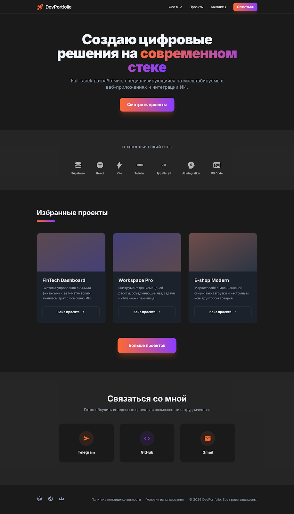

# 🚀 DevPortfolio

A personal web portfolio for a full-stack developer — a modern single-page website showcasing projects, skills, and contact information.



---

## ✨ Features

- **Dark Theme** — sleek dark interface with accent gradients
- **Responsive Layout** — seamless display on desktop and mobile devices
- **Fixed Navigation** — header with blur effect and anchor links
- **Hero Section** — bold welcome with gradient text and CTA button
- **Tech Stack Showcase** — animated display of technologies used
- **Project Cards** — 3 case studies with hover effects and descriptions
- **Contact Section** — quick links to Telegram, GitHub, and Gmail

---

## 🛠 Tech Stack

| Technology | Purpose |
| **HTML5** | Semantic page structure |
| **Tailwind CSS** (CDN) | Utility-first styling and dark mode |
| **Google Fonts** | Inter typeface (400, 500, 700, 900) |
| **Material Symbols** | UI icons |

---

## 📁 Project Structure

DevPortfolio/
├── code.html      # Main portfolio page
├── screen.png     # Design screenshot
└── README.md      # Project documentation

---

## 🚀 Quick Start

1. **Clone the repository:**

```bash
git clone https://github.com/Skinny1688/DevPortfolio.git
cd DevPortfolio
```

1. **Open in your browser:**

```bash
# Simply open the code.html file in any browser
start code.html
```

> No server required — this is a static HTML page with styles loaded via CDN.

---

## 🎨 Color Palette

| Color | HEX | Role |
| 🟠 Primary | `#FF6933` | Main accent color |
| 🟣 Accent Purple | `#8B3DFF` | Secondary accent, gradients |
| ⬛ Background Dark | `#1A1A1A` | Dark theme background |
| ⬜ Background Light | `#F8F6F5` | Light theme background |

---

## 📌 Featured Projects

| Project | Description |
| **FinTech Dashboard** | Personal finance management system with AI-powered spending analysis |
| **Workspace Pro** | Team collaboration tool combining chat, tasks, and cloud storage |
| **E-shop Modern** | High-performance marketplace with a custom product builder |

---

## 📄 License

© 2026 DevPortfolio. All rights reserved.
